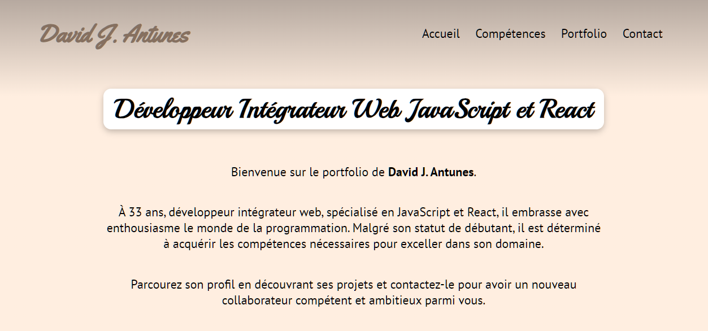

# Créez et publiez votre portfolio de développeur

Bienvenue sur mon portfolio de développeur, un espace où je partage mes réalisations, mes compétences et mon parcours en tant que développeur. 

Vous pouvez accéder à mon portfolio en ligne [ici](https://AntunesD.github.io/Portfolio).



## Présentation

Ce portfolio a été créé dans le cadre de mon projet en tant qu'étudiant chez OpenClassRoom. Il représente un échantillon de mon travail, mettant en avant mes compétences et mes projets en développement web et en programmation. Mon portfolio est conçu pour refléter mon expérience et mon expertise en développement, tout en permettant aux visiteurs de découvrir mes réalisations.

## Contenu du Portfolio

Mon portfolio comprend plusieurs sections, notamment :

- **Accueil** : Une brève introduction me concernant.
- **Compétences** : Une liste de mes compétences techniques.
- **Portfolio** : Une galerie de mes réalisations avec des descriptions détaillées.
- **Contact** : Un formulaire pour me contacter directement.

## Captures d'écran


## Technologies Utilisées

Mon portfolio a été développé en utilisant les technologies suivantes :

- HTML
- CSS
- Sass
- JavaScript
- React
- Redux

## Comment le Déployer Localement

Si vous souhaitez exécuter mon portfolio React localement, suivez ces étapes :

1. Clonez ce répertoire GitHub sur votre ordinateur :

```bash
git clone https://github.com/AntunesD/Portfolio.git
```

2. Assurez-vous d'avoir Node.js installé sur votre système. Si ce n'est pas le cas, téléchargez-le depuis [le site officiel de Node.js](https://nodejs.org/).

3. Installez les dépendances du projet en exécutant la commande suivante dans le répertoire du projet :

```bash
npm install
```

4. Démarrez le serveur de développement en utilisant la commande :

```bash
npm start
```

5. Une fois que le serveur est lancé, ouvrez votre navigateur web et accédez à l'adresse `http://localhost:3000` pour voir mon portfolio en action.

Assurez-vous que le serveur de développement est en cours d'exécution tant que vous explorez le portfolio en mode local. Vous pouvez également personnaliser davantage le contenu en modifiant les fichiers du projet.


## Contact

N'hésitez pas à me contacter à l'adresse [antunesd90@gmail.com] pour toute question ou proposition de collaboration.


Merci d'avoir visité mon portfolio !